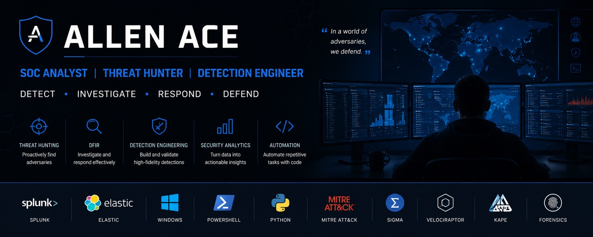

  

<h1 align="center">Allen Ace</h1>

SOC Analyst • Threat Hunter • Detection Engineer

Detect • Investigate • Respond • Defend

---

## About

I'm a cybersecurity professional focused on Blue Team operations, Threat Hunting, Detection Engineering, Digital Forensics & Incident Response (DFIR), and Security Analytics.

I build enterprise-style investigations, security tooling, and technical content to continuously improve my defensive capabilities.

---

## Current Focus

- Threat Hunting
- Detection Engineering
- Malware Analysis
- Digital Forensics (DFIR)
- Python Security Automation
- Security Analytics

---

## Portfolio

My complete cybersecurity portfolio is available here:

➡️ **SOC Analyst Portfolio**

https://github.com/0x0allenace/SOC-Analyst-Portfolio

---

## Featured Projects

- 🔎 Threat Hunting – Reconnaissance
- 🛡 Enterprise DFIR Lab
- 🦠 Static Malware Analysis
- 📧 Suspicious Email Attachment Analysis
- 🤖 Behavioural Anomaly Detection
- 🛠 File Signature Detector

---

## Tech Stack

**SIEM**

Splunk • Elastic

**Threat Detection**

Sigma • MITRE ATT&CK

**DFIR**

Velociraptor • KAPE • FTK Imager • Autopsy

**Malware Analysis**

PEStudio • FLOSS • Detect It Easy • Ghidra

**Languages**

Python • PowerShell

---

## Technical Writing

I regularly publish practical cybersecurity articles on Medium covering:

- Threat Hunting
- DFIR
- Malware Analysis
- Detection Engineering
- Security Operations

📖 [Medium](https://allenace.medium.com)

---

## Connect

- [LinkedIn](https://www.linkedin.com/in/allen-ace-soc-analyst/)
- [Medium](https://allenace.medium.com)
- [X](https://x.com/allen_acee)
- [YouTube](https://www.youtube.com/@PurpleOpsLab)

Always open to discussing:

- SOC Operations
- Threat Hunting
- Detection Engineering
- Remote Cybersecurity Opportunities